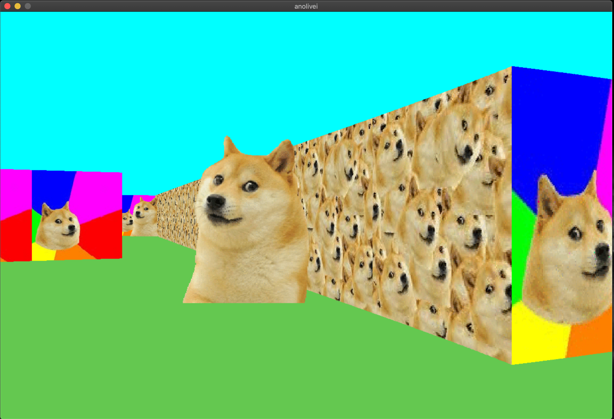
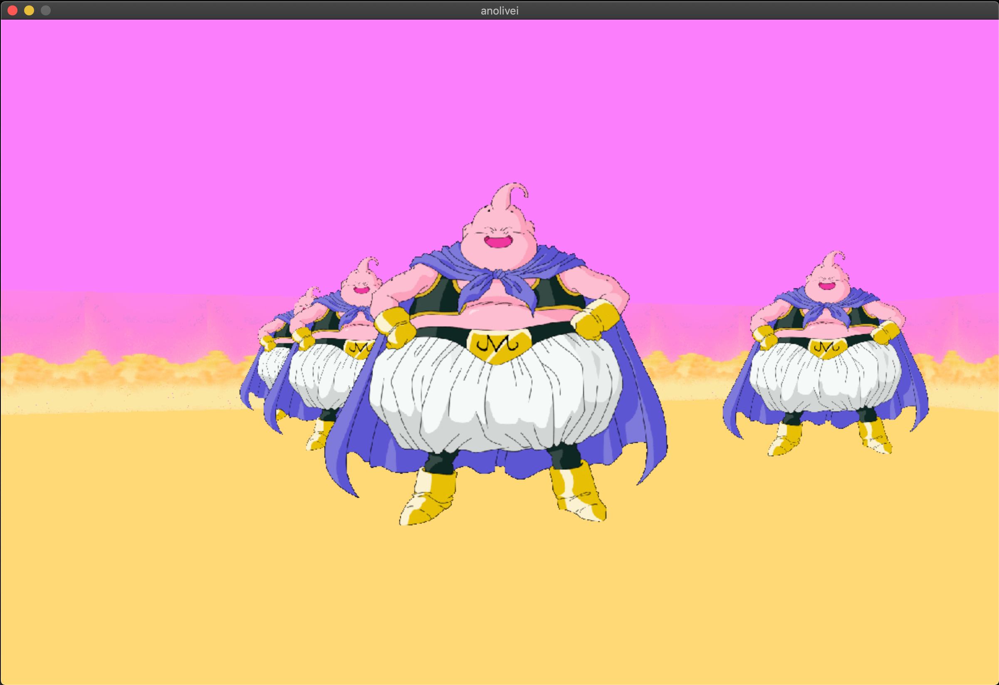
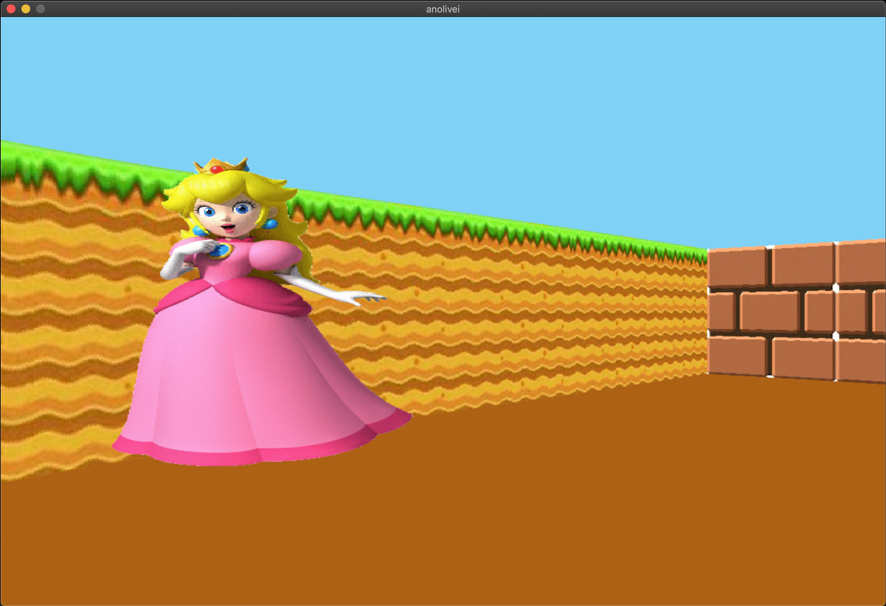
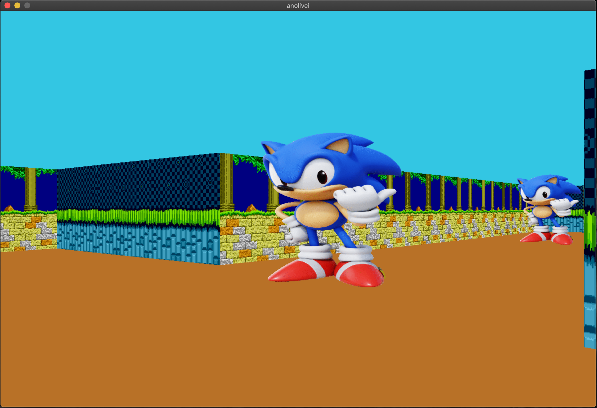
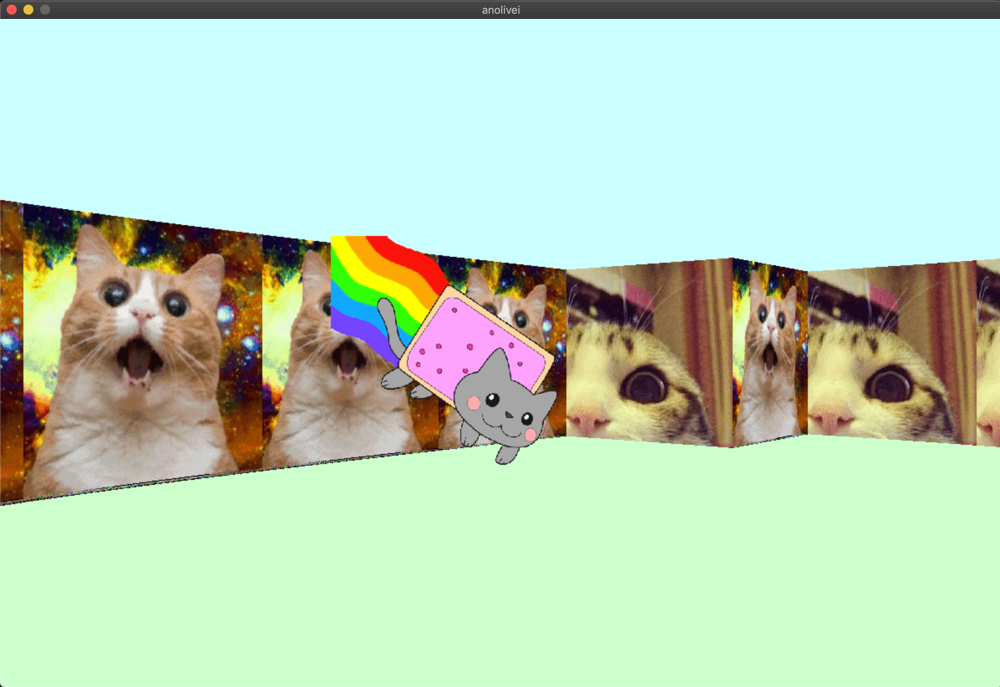

# Cub3D
My first RayCaster with miniLibX<br>
This project uses the technique of raycasting, developed by John Carmack and John Romero, creators of the game Wolfenstein 3D, the first true “First Person
Shooter” in the history of video games

## How to execute:
First of all, install minilibX in your Linux OS<br>
The minilbx library is used as a graphic library in this project<br>
```
sudo apt-get install -y libxext-dev && sudo apt-get install -y libxrandr-dev && sudo apt-get install -y libx11-dev && sudo apt-get install -y libbsd-dev && sudo apt-get install -y libssl-dev

cd /usr/local/man/ && sudo mkdir man1

cd ~ && git clone https://github.com/42Paris/minilibx-linux.git && cd minilibx-linux && make

sudo cp man/man1/* /usr/local/man/man1/ && sudo cp libmlx.a /usr/local/lib/ && sudo cp mlx.h /usr/local/include/
```
<br>

So, type make to compile the program
```
make
```

And them, execute Cub3D with a file .cub (ex: maps/map0.cub)<br>
The wall's textures, the sprite, the resolution, the colors of celling and floor and the maze can be changed inside the file *.cub
```
./cub3D maps/map0.cub
```
Use W, S, A, D to move the player in the maze<br>
Use the right arrow and the left arrow to rotate the player<br>
Use Esc or click on the red cross on the window’s frame to quit the game<br>
<br>
To save the first image that appears on a map in bmp format, type:
```
./cub3D maps/map0.cub --save
```

## Some funny images:
<center>
<table>
    <tr>
        <td></td>
        <td></td>
    </tr>   
</table>
<table>
    <tr>
        <td></td>
        <td></td>
    </tr>   
</table>
</center>
<p align="center">

</p>

## For more information about Cub3D:
Read the [Subject](https://github.com/anolivei/cub3D42/blob/master/en.subject.pdf)<br>
See the [Notion](http://bit.ly/cub3D42)<br>
<br>
